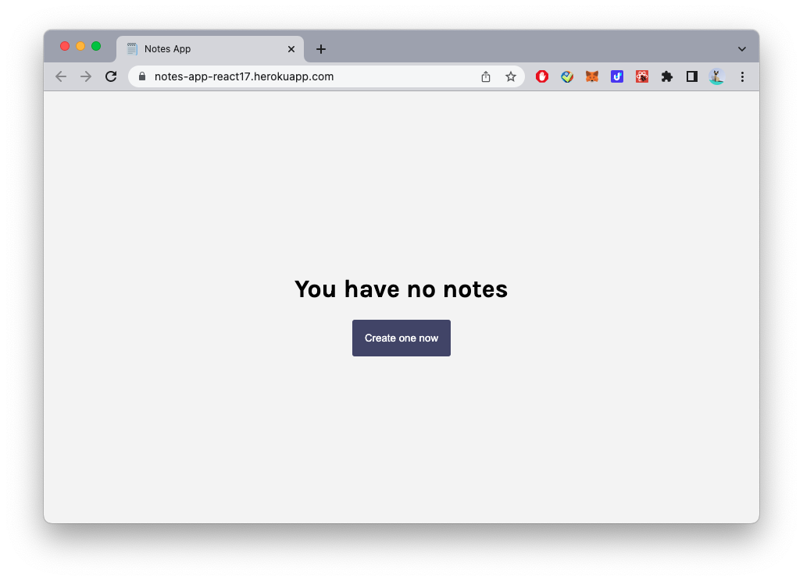
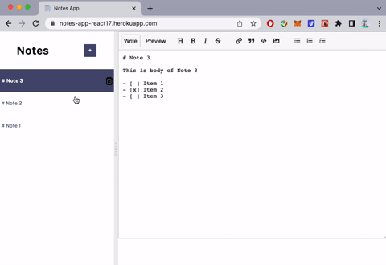

# Notes App created using React v17

[notes-app-react17.herokuapp.com](https://notes-app-react17.herokuapp.com/)

This Notes App will allow user to create new notes, edit existing notes, delete notes.
All notes are stored in local storage so even if user refreshes the page, notes won't be lost.
When user edits an old note, the edited note's position will be brought to the top of the sidebar.

## Illustrations

### Main Page When No Notes Exist

### Create New Notes

### Edit and Delete Notes

